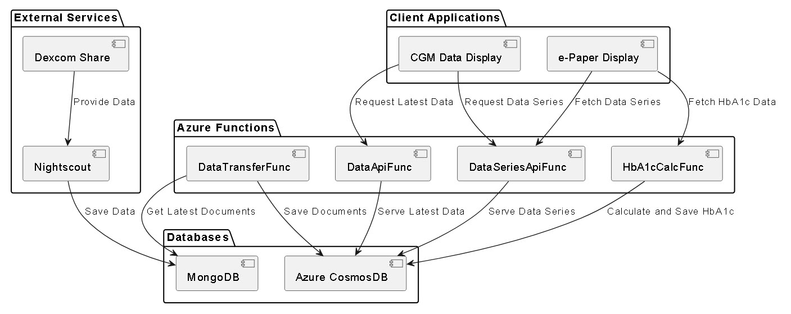
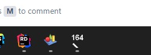
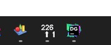
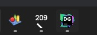

# Nightscout Companion Apps

## Table of Contents

- [Nightscout Companion Apps](#nightscout-companion-apps)
  - [Table of Contents](#table-of-contents)
  - [Intro](#intro)
  - [How to get started with Nightscout](#how-to-get-started-with-nightscout)
  - [Context](#context)
  - [Note](#note)
  - [Big picture](#big-picture)
  - [Next steps](#next-steps)
    - [General](#general)
    - [CGM Data Display (Windows Forms App)](#cgm-data-display-windows-forms-app)
    - [Data Api Function](#data-api-function)
- [CGM Data Display (Windows Forms app)](#cgm-data-display)
  - [How to use](#how-to-use)
  - [Known Issues](#known-issues)
  - [Settings](#settings)


## Intro

So I finally was able to use a CGM (continuous glucose monitor) and I was able to own the data from it, thanks to 
Nightscout and Azure! <3

In this project we currently have 3 applications:
1. CGM Data Display - An Windows forms application that shows the data from Nightscout in your taskbar.
   - File: `CGMDataDisplayApp_win-x64_<version>.zip`
2. An Azure Function that gets the data from MongoDB and saves it in Azure CosmosDB.
    - File: `AzFnDataTransfer_win-x64_<version>.zip`
3. An Azure Function that serves the data from Azure CosmosDB.
    - File: `AzFnDataApi_win-x64_<version>.zip`

> More about the functions in the context section.

> If you want to know how to use the windows app, there's a section below with all the instructions.

> All apps have a CI/CD pipeline that builds and publishes the apps to GitHub releases. The pipeline is triggered by changes in the `master` branch. 


## How to get started with Nightscout
It is important to say that I'm not affiliated with this awesome project, but if you want to get started, I can point
you in the right direction.

- Official site
  - New Users: https://nightscout.github.io/nightscout/new_user/
  - Uploaders (Is your CGM supported?): https://nightscout.github.io/uploader/uploaders/
 
- [Recommended] Tutorial on making it work in Azure for free: https://www.youtube.com/watch?v=EDADrteGBnY

## Context
While I love MongoDb, I love Azure Cosmos with Core API even more and the data stored in MongoDb is a bit big and with 
a bunch of fields that I'm not going to use. So to really own my data and use it without any collisions, conflicts or 
concerns, I decided to add an extra step in the process: Enter the Azure Functions! 

The data transfer function grabs the data from MongoDb, converts it to an internal format (created in this repo) and
saves it in Azure Cosmos. The data API function is used for me to extract that data.

> Just want to use the windows app? No worries. It also works reading data directly from MongoDb!

My plan is to set the MongoDb to auto delete old documents and keep everything in Azure Cosmos. Since the documents
are smaller, it is going to take a while for me to fill the 25Gb of free storage there.

I know that the Functions (probably the storage account associated with them) will cost me some money, but It's not
going to be that much. (In any case, I've set a budget alert to let me know if I'm spending too much.)

## Note
I created all those apps with a quick and dirty approach. They are not my best work there's lots to improve and I think
they could use some love, but they work. If you see something that could be improved, please let me know or send a PR.
Help and feedback are always welcome!

## Big picture


```
package "Azure Functions" {
  [Timer Function] as TimerFunc
  [HTTP Function] as HttpFunc
}

package "Databases" {
  [MongoDB] as MongoDb
  [Azure CosmosDB] as CosmosDb
}

[Timer Func] --> [MongoDB] : Get Latest Documents
[Timer Func] --> [CosmosDB] : Save Documents

[Http Func] --> [CosmosDB] : Serve Data

[Nightscout] --> [MongoDB] : Save Data
[Dexcom Share] --> [Nightscout]
```

This diagram illustrates the system components and their relationships. The Azure Functions consist of a Timer Function
and an HTTP Function. The Timer Function accesses the MongoDB database to get the latest documents and then saves them
in the Azure CosmosDB database. The HTTP Function serves the data stored in the CosmosDB to clients. 
The Nightscout service/app reads data from Dexcom Share and saves it in the MongoDB database.

## Next steps
I have a few plans for all the apps here. The items are in no particular order.

### General
1. Add repo to SonarCloud and fix all the issues;
2. Add more (meaningful) tests.

### CGM Data Display (Windows Forms App)
1. Add tabs to the main form and:
   - Chart: Showing the data collected since the app was opened;
   - Settings: To allow the user to change the settings without having to edit the config file;
   - Logs: To show what the app is doing and help users troubleshoot issues;
2. Add a button to force refreshing the data.
3. Add an option to show different data in the notification icon (like a color depending on the current glucose value or an icon that represents the current trend);
4. General code clean-up.

### Data Api Function
1. Allow to fetch more data at once (like last 24 hours, last week, etc);
2. Add an option pagination, depending on the amount of data requested.
3. General code clean-up.


# CGM Data Display
## How to use
After downloading the zip file and extracting it, you'll need to edit the `appsettings.json` with your data, then
just run the `CGMDataDisplayApp.exe` file and wait. After the refresh time is up, the app will show the data and show it
in the Taskbar and notification area. If you keep it open, it will refresh the data automatically.

> If you don't want to use the compiled app, feel free to clone this repo and build the app.

## Known Issues
Due to the way Windows caches icons, if you create a shortcut to the app (`CGMDataDisplay.exe`) the taskbar the icon 
will not update. To work around that, you can create a shortcut to the launcher (`CGMDataDisplay.Launcher.exe`). 
This launcher will simply start the CGM Data Display app and go away. This will make the taskbar icon update properly.

## Settings
This repo as an `appsettings.sample.json` ([link](Raccoon.Ninja.WForm.GlucoseIcon/appsettings.sample.json)) that can be 
used as a base, but here's how it work:

```json
{
  "General": {
    "RefreshIntervalInMinutes": 5, // Data fresh time in minutes. Nightscout updates every 5 minutes, so we're using the same value.
    "FontFamily": "Arial" // Font family to be used in the taskbar and notification area.
  },
  "DataSource": { // Data source configuration. This is where you configure how the app will get the data.
    "SelectedSource": 2, // 1 - MongoDb, 2 - Azure Functions
    "AzureFunction": { // Only needed if you selected Azure Functions as the data source. (SelectedSource: 2)
      "BaseUrl": "", // Full URL for the Azure Function with the route.
      "ApiKey": "", // The API key for Azure Functions.
      "PostBodyText": { // This is something that I created. It's not native to Azure. It's like an extra key. 
        "Key": "" // Can be anything, as long as it is the same in the Azure Function.
      }
    },
    "MongoDb": { // Only required if you selected MongoDb as the data source. (SelectedSource: 1)
      "ConnectionString": "", // Connection string to your MongoDb database.
      "DatabaseName": "", // Name of the MongoDb database.
      "CollectionName": "entries" // Name of the collection that has the data. You probably want to add the "entries" collection.
    }
  }, // The following sections are here to configure the font size for the taskbar and notification area. I created 1 for Windows 10 and another for Windows 11 because I use this app in both OSes.
  "Win10TaskbarIconOverlayFontConfig": {
    "FirstLineFontSize": 12, // First line of the Taskbar icon. (Glucose value)
    "SecondLineFontSize1Char": 12, // When the second line of the Taskbar icon (Trend) has only 1 character.
    "SecondLineFontSize2Char": 10, // When the second line of the Taskbar icon (Trend) has 2 characters.
    "SecondLineFontSize3Char": 8 // When the second line of the Taskbar icon (Trend) has 3 characters.
  },
  "Win11TaskbarIconOverlayFontConfig": { // Same logic as above, but for Windows 11.
    "FirstLineFontSize": 8,
    "SecondLineFontSize1Char": 10,
    "SecondLineFontSize2Char": 8,
    "SecondLineFontSize3Char": 6
  },
  "Win10NotificationIconFontConfig": { 
    "FirstLineFontSize": 7, // First line of the notification icon. (Glucose value)
    "SecondLineFontSize": 6 // Second line of the notification icon. (Trend)
  },
  "Win11NotificationIconFontConfig": { // Same logic as above, but for Windows 11.
    "FirstLineFontSize": 5,
    "SecondLineFontSize": 4
  }
}
```





# Azure Function - Data Transfer
If you want to use this function, you'll need to set the following environment variables:
- `MongoDbConnectionString`: Connection string to your MongoDb database.
- `MongoDbDatabaseName`: Name of the MongoDb database.
- `MongoDbCollectionName`: Name of the collection that has the data. You probably want to add the "entries" collection.
- `CosmosConnectionString`: Connection string to your Azure CosmosDB database.
- `CosmosDatabaseName`: Name of the Azure CosmosDB database.
- `CosmosContainerName`: Name of the collection that has the data. You probably want to add the "entries" collection.

# Azure Function - Data Api
If you want to use this function, you'll need to set the following environment variables:
- `CosmosConnectionString`: Connection string to your Azure CosmosDB database.
- `CosmosDatabaseName`: Name of the Azure CosmosDB database.
- `CosmosContainerName`: Name of the collection that has the data. You probably want to add the "entries" collection.
- `SillySecret`: This is an arbitrary string that the function expects to receive. If you don't send it, the function will return a 401 error. I know it's not the best extra security ever implemented in an application, but I like the idea. If you're going to use and don't want that, feel free to remove it from the implementation.
- `DataSeriesMaxRecords`: Max number of records that can be returned at once by the DataSeriesApiFunc. If not provided, will use 4032 (two weeks worth of data).
